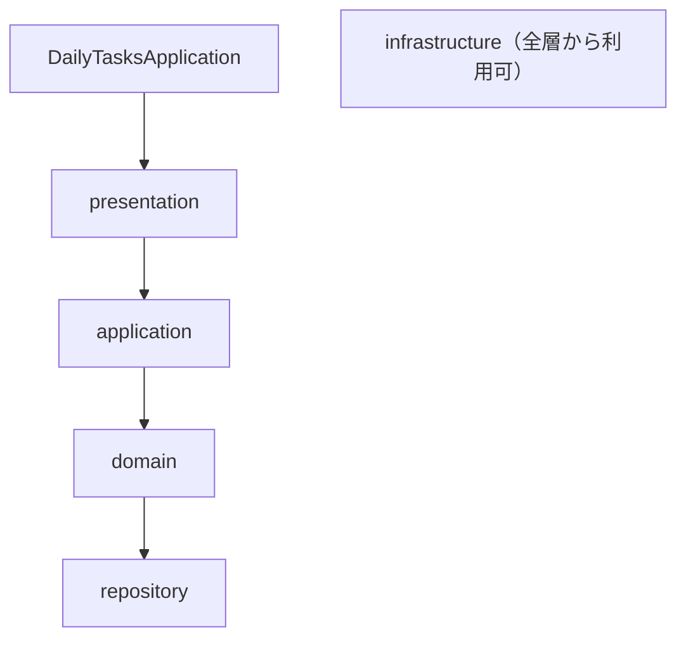

# AGENTS.md — daily-tasks

AI コーディングエージェント向けの作業ガイド。
Cursor / Codex / Claude Code など複数ツールで共通利用する。

本ドキュメントはプロジェクト全体の共通事項と、Java の収集ツールのルールをまとめる。
`frontend/` 配下（画面）の作業では、[frontend/AGENTS.md](frontend/AGENTS.md) もあわせて守る。

## プロジェクト概要

- **役割**: GitHub Issue（1 日 1 Issue）で管理している日々のタスクのうち、「持ち越し」（旧「繰り越し」「負債」）を集計し、グラフとして GitHub Pages に公開する
- **構成**: Java の収集ツール（Issue 取得 → 解析 → `docs/data/` に JSON 出力、Maven プロジェクト）と、`frontend/` 配下の画面（Next.js + TypeScript の静的エクスポート）を 1 つのリポジトリで管理する
- **GAV**: `io.github.kenichiroarai` : `daily-tasks`
- **ルートパッケージ**: `io.github.kenichiroarai.dailytasks`
- **対象リポジトリ**: `https://github.com/KenichiroArai/daily-tasks-git/`（Issue #1 から最新まで）

## 技術スタック

- 言語: Java 25（Temurin）
- フレームワーク: Spring Boot 4.x（`spring-boot-starter-parent`。DI・設定ファイルのバインド・メッセージ・ログ。Web サーバーは起動しない CLI アプリ）
- ビルド / パッケージ管理: Maven（spring-boot-maven-plugin で実行可能 jar を作成）
- ライブラリ: Jackson 3（JSON。パッケージは `tools.jackson.*`、アノテーションは `com.fasterxml.jackson.annotation`）、SLF4J + Logback（ログ）
- HTTP: 標準の `java.net.http.HttpClient`（GitHub REST API）
- フロントエンド: Next.js（App Router、`output: 'export'` の静的エクスポート）+ TypeScript + React + Recharts、zod（JSON の検証）、CSS Modules。Node.js 20.9 以降（CI は 22）
- 公開: GitHub Pages（GitHub Actions でデプロイ）
- テスト: JUnit 5 / JaCoCo（行・分岐 100%）/ ArchUnit（層間のルールの検査）。フロントエンドは Vitest + Testing Library、ESLint、Prettier
- 外部の社内基盤ライブラリ（kmg-core / kmg-fund など）には依存しない

## ディレクトリ構成

```text
pom.xml
src/main/java/io/github/kenichiroarai/dailytasks/
  DailyTasksApplication.java # 起動クラス（Spring Boot を起動するだけ）
  carryover/                 # 機能パッケージ（持ち越しの収集・集計）
    presentation/            # CLI などの入出力層
      command/               # コマンドのインタフェース（CommandLineRunner を継承）
      command/impl/          # コマンドの実装（run で引数の解析、設定値の作成）
      config/                # 設定ファイルの値（@ConfigurationProperties の CarryoverProperties）
      model/                 # 引数を解析したオプション（CarryoverOptions）
    application/             # ユースケースや業務ロジック層
      model/                 # application が受け取る設定（CarryoverSettings）
      service/               # サービスのインタフェース
      service/impl/          # サービスの実装（収集・解析・集計の流れ）
    domain/                  # 共通ロジック、ドメインモデル層
      model/                 # Issue、持ち越し項目、日別集計、domain が受け取る設定などのモデル
      service/               # データの取得・保存サービスのインタフェース
      service/impl/          # データの取得・保存サービスの実装（repository を使う）
      parser/                # Issue 本文の解析のインタフェース
      parser/impl/           # Issue 本文の解析ルール
      aggregator/            # 日別の集計のインタフェース
      aggregator/impl/       # 日別の集計の実装
      converter/             # repository の DTO と domain のモデルの変換
    infrastructure/          # 業務を知らない汎用ユーティリティ
      resource/              # メッセージの取得のインタフェース（MessageProvider）
      resource/impl/         # メッセージの取得の実装（Spring の MessageSource を使う MessageProviderImpl）
    repository/              # データアクセス層（Dao）。JSON ファイルの読み書きのインタフェース
      impl/                  # JSON ファイルの読み書きの実装
      dto/                   # repository が入出力に使う DTO（JSON・API 応答の形、設定）
      github/                # GitHub REST API からの Issue 取得のインタフェース
      github/impl/           # GitHub REST API からの Issue 取得の実装
src/main/resources/
  application.properties     # 設定値（carryover.*: 対象リポジトリ、トークン、出力先、標準時間のファイル、最新の件数。spring.*: Spring Boot の設定）
  messages.properties        # 文字列（使い方、ログ・例外のメッセージ）
  logback-spring.xml
src/test/java/io/github/kenichiroarai/dailytasks/  # main と同じ構成
  testutil/                  # テスト用のユーティリティ（ログ取得、リフレクション、メッセージの取得の生成など）
src/test/resources/          # テスト用のリソース
config/
  default-minutes.json       # 時間表記なしの行を補完する項目ごとの標準時間
docs/                        # 収集ツールが出力するデータだけを置く（ソースコードは置かない）
  data/
    issues/NNNN.json         # Issue ごとの解析結果（4 桁ゼロ埋め）
    summary.json             # 画面用の日別集計
frontend/                    # 画面（Next.js + TypeScript）。詳細は frontend/AGENTS.md
  AGENTS.md                  # フロントエンドの作業ガイド
  docs/                      # フロントエンドの設計書
  src/                       # 画面のソースコード
.github/
  ISSUE_TEMPLATE/            # 日々のタスク Issue のテンプレート
  workflows/                 # 収集と Pages デプロイのワークフロー
```

## パッケージ構成のルール

- `io.github.kenichiroarai.dailytasks` の直下に機能パッケージ（例: `carryover`）を置く
- 各機能パッケージは次の 5 層で構成する

| 層 | 役割 |
| --- | --- |
| `presentation/` | CLI などの入出力層（command など） |
| `application/` | ユースケースや業務ロジック層（service など） |
| `domain/` | 共通ロジック、ドメインモデル層（model / parser など） |
| `infrastructure/` | 業務やドメインを知らない、他の層に依存しない汎用のユーティリティ（メッセージの取得など） |
| `repository/` | JSON ファイル・GitHub API などのデータアクセス層（Dao） |

- 新しい機能は `carryover/` と同じ構成で追加する
- 中身のないパッケージには、Git で消えないように Javadoc 付きの `package-info.java` を置く
- 外部のデータ取得元（GitHub API など）へのアクセスは、ファイルと同じくデータアクセスとして `repository/` に置く（例: `repository/github/GitHubIssueRepository`）
- テストのパッケージは main と同じ構成にする

## 層間のルール

各層がごちゃごちゃにならず、処理の流れを上から下へ一本で追えるようにするため、参照できる先を制限し、飛び越しをさせない。



### 参照の向き

- 参照は矢印の向きに「すぐ下の層」だけにする。逆向きの参照と飛び越しは禁止する
  - 禁止の例: application → repository、presentation → domain、エントリポイント → application、repository → domain
- infrastructure は全層から参照してよい。infrastructure から他の層は参照しない
- infrastructure には業務やドメインを知らない汎用のユーティリティだけを置く。機能固有の値（対象リポジトリ、出力先など）や業務の判断は置かない

### 公開するものと実装

- 各層は、上の層に公開するもの（インタフェースと受け渡し用のデータ型）を層の直下のパッケージ（`service/`、`parser/`、`repository/` など）に置き、実装は `impl/` に置く
- 上の層は `impl/` のクラスを型（フィールド・引数・戻り値・変数の型）として使わない。テストで実装を組み立てるときだけ参照してよい

### DI（依存性の注入）

- 実装クラスは Spring の Bean として登録し、生成と組み立ては Spring に任せる。自分で `new` して下の層の実装を生成しない
  - presentation のコマンド・infrastructure の実装・domain のパーサー／集計／変換: `@Component`
  - application と domain のサービス: `@Service`
  - repository の実装: `@Repository`
- 注入はコンストラクタインジェクションだけにする。フィールドインジェクション（フィールドへの `@Autowired`）は使わない
- 受け取るのは「すぐ下の層のインタフェース」（と infrastructure のインタフェース、`JsonMapper` などのフレームワークの部品）とする
- コンストラクタが 1 つなら `@Autowired` は付けない。テスト用のコンストラクタ（出力先や `HttpClient` の差し替えなど）を別に持つ場合だけ、本番用のコンストラクタに `@Autowired` を付ける
- Bean はステートレス（シングルトンで状態を持たない）にする。設定値はフィールドに持たず、メソッドの引数で渡す
- コマンドは `CommandLineRunner` として Spring Boot の起動後に実行する。起動クラスは `SpringApplication.run` を呼ぶだけとする

### データの受け渡しと変換

- 受け渡すデータ型は、その層が持つものを使う。変換は「下の層を知っている側（上の層）」で行う
  - repository は自分の DTO（`repository/dto/`）を入出力に使い、domain のモデルを知らない。JSON の形（Jackson のアノテーション）は DTO だけが持つ
  - domain は repository の DTO と domain のモデルを相互に変換する（`domain/converter/`）。両方を知っているのは domain だけである
  - application は domain のモデルだけを使い、presentation には件数などの結果だけを返す
- DTO や repository のインタフェースを domain に置かない。repository の実装がそれを実装すると repository → domain の逆向き参照になるため。差し替えやすさは、repository 自身がインタフェースを公開し実装を `impl/` に分けることで確保する

### 設定値の引き継ぎ

- 設定値も業務データと同じく、上の層から下の層へ引き継ぎ、境界ごとに下の層の型に変換して渡す。どこからでも参照できる共有の設定（infrastructure の設定クラスなど）は作らない
- 値の出どころは入力の窓口である presentation（コマンドライン引数・設定ファイル `src/main/resources/application.properties`）とする。設定ファイルは presentation だけが読み込む
  - 設定ファイルの `carryover.*` は `presentation/config/CarryoverProperties`（`@ConfigurationProperties`、コンストラクタでバインド）で受け取る。`@ConfigurationProperties` のクラスは presentation にだけ置く
  - トークンは `carryover.token=${GITHUB_TOKEN:}` として環境変数 `GITHUB_TOKEN` から設定する
  - `@Value` で設定値を個別に取得しない。`Environment` を各層から参照しない
  - presentation → application: `application/model/CarryoverSettings`
  - application → domain: `domain/model/CarryoverSource`
  - domain → repository: `repository/dto/GitHubSettingsDto`、ファイルのパス（`Path`）
- GitHub API のベース URL のような、業務の設定ではない技術的な固定値は、それを使う repository の実装の定数にする
- トークンは設定型の `toString` に含めない

### 文字列（メッセージ）の管理

- 使い方、ログ・例外のメッセージは `src/main/resources/messages.properties` に置き、各クラスはキーを定数で持って、コンストラクタで注入した `infrastructure/resource/MessageProvider` で取得する
- `MessageProvider` は Spring の `MessageSource`（`spring.messages.*` で設定）を引数なしで使うため、`{}` や `%s` はそのまま返る
- ログは SLF4J の `{}`、例外は `String.format` の `%s` / `%d` を埋め込み位置に使う。取得したメッセージはいったん変数に入れてから渡す
- 解析ルールそのものの文字列（対象セクション名、正規表現など）は messages.properties に置かず、それを使う実装の定数にする

### ルールの検査

- 層間のルール、フィールドインジェクションの禁止、`@Value` の禁止、`@ConfigurationProperties` を presentation にだけ置くことは `ArchitectureTest`（ArchUnit）で検査する。違反があると `mvn test` は失敗する

## フロントエンド

フロントエンドの構成ルール、設計書の扱い、TypeScript のコーディングルール、ビルド・テストのコマンドは [frontend/AGENTS.md](frontend/AGENTS.md) に記載する。

## Issue 解析の仕様

- 日付は Issue タイトルの `YYYY年MM月DD日` から取得し、「その日の残」の日付とする
- 対象セクションは `## 負債`（#175〜#229）、`## 繰り越し`（#230〜#350）、`## 持ち越し`（#351〜）。次の `##` までを対象とする
- `## ルーティン`、`## 汎用タスク`、`## 追加`、`## 先行` は対象外
- 未チェック（`- [ ]`）・チェック済み（`- [x]`）の両方を対象とし、`checked` フラグで区別する
- 行の形式は `項目名YYYY/MM/DD（時間表記）`。時間表記は次のいずれか
  - `残り時間：N分`
  - `N分`
  - `残りN分`
  - `先行分残りN分`
  - 時間表記なし → `config/default-minutes.json` の標準時間で補完し、`minutesSource` を `default` とする
- N は小数（例: `8.5`）を許容する
- 本文の `残：N` は検証用に `declaredCount` として保存し、解析件数と食い違う場合は警告ログを出す
- 項目名は正規化する（末尾の `(` や `（15分）` などの混入を除去）

## 収集と公開

- Issue の一覧は毎回すべて取得する（100 件 / ページ）。解析・保存するかどうかはモードで決める
- 差分モード（既定）: 保存済みの JSON（`docs/data/issues/NNNN.json` の `updatedAt`）を「どこまで処理したか」の記録として使う。Issue 番号が大きい順の最新 10 件（10 日分）は `updatedAt` に関係なく毎回解析し直して上書きする。それより前の Issue は、未取得の Issue と更新された Issue（編集やクローズを含む）だけを解析・保存する
- 全件モード（`--full`）: #1 から最新まで解析し直す。解析ルールや標準時間を変えた場合はこちらを使う
- 集計（`summary.json`）は、対象セクションが最初に現れた Issue（#175）以降を毎回すべて作り直す
- 出力した `docs/data/` 配下の JSON は Git で管理する
- GitHub Actions（`.github/workflows/update-carryover.yml`）は毎日のスケジュール、手動実行（`full` 入力あり）、`main` への push で動き（Issue の編集ごとにコミットされないよう、Issue イベントでは動かさない）、差分を commit したあと `frontend/` をビルド（lint・型チェック・テストを含む）し、`frontend/out` を Pages にデプロイする。basePath は `actions/configure-pages` の出力を環境変数 `PAGES_BASE_PATH` で渡す
- GitHub Pages の Source は「GitHub Actions」にする
- GitHub API のトークンは環境変数 `GITHUB_TOKEN` から取得する

## ビルド・テスト

```bash
# テスト（JaCoCo 100% チェック）+ 実行可能 jar の作成:
mvn clean package

# テストのみ:
mvn test

# 収集の実行（差分モード / 全件モード）:
java -jar target/daily-tasks-0.1.0.jar
java -jar target/daily-tasks-0.1.0.jar --full
```

- 画面のビルド・テストのコマンドは [frontend/AGENTS.md](frontend/AGENTS.md) を参照する

- カバレッジレポート: `target/site/jacoco/index.html`
- 行 / 分岐カバレッジが 100% 未満だと `mvn test` は失敗する

## Eclipse

- 「ファイル」→「インポート」→「Maven」→「既存 Maven プロジェクト」でリポジトリのルート（`pom.xml`）を読み込む
- Java 25 に対応した Eclipse（2025-09 以降）を使い、JDK 25 をインストール済み JRE に登録する
- `.classpath`、`.project`、`.settings/`、`bin/` は Git で管理しない。`pom.xml` を変更したら「Maven」→「プロジェクトの更新」で反映する

## 作業時の原則

- Issue 本文のフォーマットの揺れに強い解析にする（想定外の行は落とさずに警告ログを出す）
- 既存の JSON の形式を変える場合は、全件モードで再生成できることを確認する
- 本ドキュメントのパッケージ構成ルール・コーディングルール・テストルール・Javadoc ルールに従う
- `target/` はビルド生成物であり、Git で管理しない
- `frontend/node_modules/`、`frontend/.next/`、`frontend/out/`、`frontend/public/data/`（`docs/data/` のコピー）も Git で管理しない

## Java のコーディングルール

### メソッドの戻り値

- メソッドの戻り値は変数 `result` で定義する
- メソッドの戻り値の変数は先頭で宣言する
- return 文は `return result;` に統一する
- このルールは TypeScript（`frontend/`）にも適用する。React コンポーネントの JSX など対象外とするものは [frontend/AGENTS.md](frontend/AGENTS.md) の「TypeScript のコーディングルール」を参照する

### 処理コメント

- 機能ごと、処理のまとまり単位に `/* コメント */` で記載する
- 通常コメントは `//` で記載する

### Javadoc

- 修飾子に限らず必須
- 後述の「Javadoc のフォーマットルール」に従う

### アクセス修飾子

- 外部に公開しないもの、サブクラスも使わないもの（フィールド・メソッド・コンストラクタ・入れ子クラス）は `private` にする
- 修飾子なし（パッケージプライベート）は原則として禁止する。enum のコンストラクタも `private` を明示する
- テストから呼び出すためだけにパッケージプライベートにしない。テストでは `testutil/ReflectionTestUtil`（標準のリフレクション）で private のメソッド・フィールドにアクセスする
- 例外: JUnit の `@TempDir` フィールドなど、フレームワークの制約で `private` にできないもの。インタフェースのメソッドは暗黙的に `public` なので修飾子を付けなくてよい

### record の禁止

- `record` は使用しない。DTO や値オブジェクトも通常の `class` で定義する
- 理由: アクセサ・コンストラクタ・`equals` / `hashCode` / `toString` が自動生成されソース上に行が存在しないため、ブレークポイントを設定できず、どこで参照されたかのトレースやデバッグができない
- 代わりに次の形で実装する
  - フィールドは `private`（変更不要なら `final`）で定義する
  - 値はコンストラクタ（またはセッター）で設定する
  - 値の取得は `getXxx()` 形式のゲッターを明示的に定義する（JSON 変換時もゲッターが呼ばれるため、ブレークポイントで参照箇所を追える）
  - `equals` / `hashCode` / `toString` が必要な場合は明示的に実装する

```java
// 望ましくない形式:
public record CarryoverItem(String name) {
}

// 望ましい形式:
public class CarryoverItem {

    private final String name;

    public CarryoverItem(final String name) {

        this.name = name;

    }

    public String getName() {

        final String result = this.name;
        return result;

    }

}
```

### 早期リターンパターン

- 早期リターン（ガード節）を使用し、不要なネストを避ける
- 条件が満たされない場合は早期に `return` する
- if-else の代わりにガード節を使い、インデントの深さを最小限に抑える

```java
// 望ましくない形式:
if (condition) {
    // 処理A
    // 処理B
}

// 望ましい形式:
if (!condition) {
    return result;
}
// 処理A
// 処理B
```

```java
public boolean someMethod(String input) {
    boolean result = false;  // 先頭で戻り値変数を宣言

    // 早期リターン（ガード節）
    if (input == null) {
        return result;
    }

    // メインの処理
    result = true;

    return result;  // 統一された形式で return
}
```

## テストのコーディングルール

### テスト単位

- メソッド単位で行い、`private` / `protected` / デフォルト / `public` すべて対象とする
- private メソッド・private 変数へのアクセスは標準のリフレクション（`java.lang.reflect`）を使う。共通処理はテスト用のユーティリティクラスにまとめる

### テストクラスのアノテーション

```java
@SuppressWarnings({
    "nls", "static-method"
})
```

### テストメソッド名

- `testXxx_パターンYyy` の形式とする
- 「Xxx」の先頭は大文字で対象メソッド名を入れる
- 「パターン」は正常系 `normal`、準正常系 `semi`、異常系 `error` とする
- 「Yyy」の先頭は大文字でテスト項目を入れる
- 例: `testXxx_normalYyy` / `testXxx_semiYyy` / `testXxx_errorYyy`

### テストメソッドのアクセス修飾子

- `testXXX` メソッドのアクセス修飾子はすべて `public` にする

### テストメソッドの中身

- 対象メソッドごとに行い、1 つのテストメソッドに 1 つのテストを実装する
- 正常系・準正常系・異常系に分けて実装する
  - 正常系: 正常処理が完了するパターン（正常に return され、throw されない）
  - 準正常系: 処理が正しく完了しないパターン（引数不正などにより return または throw）
  - 異常系: 正常系・準正常系以外の想定外パターン（通信エラー・ファイル入出力エラーなどにより throw）
- GitHub API への実通信はテストで行わない（`HttpClient` をモック化するか、テスト用のレスポンスを使う）

### テストメソッドの Javadoc

- フォーマット: `対象メソッド名 メソッドのテスト - パターン:テスト内容`
- パターンには正常系・準正常系・異常系を入れる

```java
/**
 * targetMethod メソッドのテスト - 正常系:引数が1文字の場合
 */
```

### テストコードの実装順序

1. **期待値の定義** — `/* 期待値の定義 */`、`expected` で始まる変数
2. **準備** — `/* 準備 */`、`test` で始まる変数
3. **テスト対象の実行** — `/* テスト対象の実行 */`、`test` で始まる変数
4. **検証の準備** — `/* 検証の準備 */`、`actual` で始まる変数
5. **検証の実施** — `/* 検証の実施 */`
   - `Assertions.assertTrue` / `assertFalse` / `assertEquals` は `actualXXX` と説明を記載する
   - `Assertions.assertEquals` は `expectedXXX` と `actualXXX` と説明を記載する

### 検証方法の指定

- 1 行ずつ検証する
- `Assertions.assertTrue` / `assertFalse` は、`Assertions.assertEquals` で代行できる場合は代行する。ただし `condition` が `boolean` なら `assertTrue` / `assertFalse` を使用する
- 例外の検証は `Assertions.assertThrows` を使い、例外の型とメッセージを検証する
- `isInstance` / `instanceof` の比較は `Assertions.assertInstanceOf` を使用する
- null チェックは `Assertions.assertNull` を使用する
- それ以外は `Assertions.assertEquals` を使用し、期待値は「期待値の定義」の値を使う

### メッセージの検証

- ログメッセージは Logback の `ListAppender` で取得し、1 行ずつ検証する

```java
@Test
public void testMethod() {

    /* 期待値の定義 */
    final String[] expectedMsgs = {
            "メッセージ1",
            "メッセージ2",
            "メッセージ3",
    };
    /* 準備 */

    /* テスト対象の実行 */

    /* 検証の準備 */
    final String[] actualMsgs = this.listAppender.list.stream().map(ILoggingEvent::getFormattedMessage)
        .toArray(String[]::new);

    /* 検証の実施 */

    // ログのチェック
    final int verMsgLength = Math.min(expectedMsgs.length, actualMsgs.length);

    for (int i = 0; i < verMsgLength; i++) {

        Assertions.assertEquals(expectedMsgs[i], actualMsgs[i],
            String.format("メッセージが一致しません: %s", expectedMsgs[i]));

    }

    // ログの数のチェック
    Assertions.assertEquals(expectedMsgs.length, actualMsgs.length);

}
```

## Javadoc のフォーマットルール

### 基本形式

```java
/**
 * クラスの説明をここに書きます。
 * 複数行の説明の場合は、このように記述します。
 *
 * @author 作成者名
 * @version バージョン番号
 * @since いつからこのクラスが存在するか（例：0.1.0）
 */
public class SampleClass {

    /**
     * フィールドの説明をここに書きます。
     */
    private String field;

    /**
     * メソッドの説明をここに書きます。
     * 処理の詳細や目的を記述します。
     *
     * @param param1 最初のパラメータの説明
     * @param param2 2番目のパラメータの説明
     * @return 戻り値の説明
     * @throws Exception1 例外が発生する条件の説明
     * @throws Exception2 別の例外が発生する条件の説明
     * @see 関連するクラスやメソッドへの参照
     * @deprecated 非推奨となった場合の説明（該当する場合）
     */
    public String sampleMethod(String param1, int param2) throws Exception {
        // メソッドの実装
    }
}
```

### 主要なタグ

| タグ | 用途 |
| --- | --- |
| `@param` | メソッドのパラメータの説明 |
| `@return` | 戻り値の説明 |
| `@throws` | 発生する可能性のある例外の説明 |
| `@author` | 作成者 |
| `@version` | バージョン情報 |
| `@since` | 導入されたバージョン |
| `@see` | 関連する他のクラスやメソッドへの参照 |
| `@deprecated` | 非推奨であることを示す |
| `@link` | 他のクラスやメソッドへのリンク |
| `@code` | コードの例を示す |
| `@value` | 定数値を参照する |
| `@serial` | シリアライズに関する情報 |

### 記述ガイドライン

- 最初の文は要約文として簡潔に書く
- 完全な文章で、技術的に正確に記述する
- 必要な情報を漏れなく記載し、HTML タグを適切に使う

コード例:

```java
/**
 * サンプルコードの使用例：
 * <pre>
 * {@code
 *     String result = obj.sampleMethod("test", 123);
 * }
 * </pre>
 */
```

リンク:

```java
/**
 * 詳細は{@link OtherClass#otherMethod()}を参照してください。
 */
```

箇条書き:

```java
/**
 * このメソッドは以下の処理を行います：
 * <ul>
 * <li>データの検証</li>
 * <li>データの変換</li>
 * <li>結果の保存</li>
 * </ul>
 */
```

### チーム統一フォーマット例

```java
/**
 * [クラス/メソッド/フィールドの名前]の説明
 *
 * 詳細な説明（必要な場合）
 *
 * 業務ロジックの説明（必要な場合）
 *
 * @author      作成者 <email@example.com>
 * @param       [引数名] [引数の説明]
 * @return      [戻り値の説明]
 * @throws      [例外クラス名] [例外の発生条件]
 * @see         [参照すべき他のクラスやメソッド]
 * @since       [追加されたバージョン]
 * @version     [現在のバージョン]
 * @deprecated  [非推奨となった理由と代替手段]（該当する場合）
 */
```

## 変更時のチェックリスト

- [ ] パッケージ構成ルール（機能パッケージ + 5 層）の順守
- [ ] 層間のルール（すぐ下の層だけを参照、飛び越し・逆向き参照なし、`impl/` を型として使わない、データ・設定値は境界で変換）の順守（`ArchitectureTest` が通ること）
- [ ] DI のルール（Bean として登録、コンストラクタインジェクション、ステートレス、設定値はメソッドの引数で渡す）の順守
- [ ] JSON 形式の後方互換の確認（変更時は全件モードで再生成）
- [ ] テストの追加 / 更新（命名・実装順序・検証方法を含む）
- [ ] `mvn test` で JaCoCo カバレッジ 100% を維持
- [ ] コーディングルール（戻り値 `result`、早期リターン、処理コメント、`record` 禁止）の順守
- [ ] アクセス修飾子の順守（公開しないものは `private`、修飾子なしは原則禁止）
- [ ] Javadoc の追加 / 更新
- [ ] 解析ルールを変更した場合、`declaredCount` との食い違いと補完件数のログを確認
- [ ] 画面を変更した場合、[frontend/AGENTS.md](frontend/AGENTS.md) の「変更時のチェックリスト」を確認
- [ ] README の更新

## やってはいけないこと

- 機能パッケージの外（`io.github.kenichiroarai.dailytasks` 直下など。起動クラスを除く）に業務クラスを置くこと
- 層を飛び越して参照すること（例: application → repository、presentation → domain、エントリポイント → application）
- 下の層から上の層を参照すること（例: repository → domain、domain → application）
- 上の層で下の層の `impl/` のクラスを型として使うこと（テストで組み立てるときだけ参照してよい）
- フィールドインジェクション（フィールドへの `@Autowired`）、`@Value` での設定値の個別取得、Bean のフィールドに設定値を持つこと
- infrastructure に機能固有の値や業務の判断を置くこと、infrastructure から他の層を参照すること
- kmg-core / kmg-fund などの社内基盤ライブラリに依存すること
- シークレット（`GITHUB_TOKEN` など）をコード・ログ・JSON に出すこと
- テストで GitHub API に実通信すること
- `docs/data/` の JSON を手で編集すること（必ず収集ツールで生成する）
- `docs/` にソースコード（HTML / JS / CSS など）を置くこと（画面のソースは `frontend/` に置く）
- `record` を使うこと（ブレークポイントを設定できずデバッグ・トレースの妨げになるため。通常の `class` とゲッターで実装する）
- 外部に公開しないメンバーを修飾子なし（パッケージプライベート）にすること（テストのためだけに公開範囲を広げない）
- 深いネストのままガード節を使わずに実装すること
- テストメソッドに複数ケースを詰め込むこと

## 参考リンク

- README: `./README.md`
- フロントエンドの作業ガイド: `./frontend/AGENTS.md`
- フロントエンドの設計書: `./frontend/docs/design.md`
- GitHub REST API（Issues）: `https://docs.github.com/rest/issues/issues`

## 順守

以上の内容を順守し、タスクを遂行してください。
