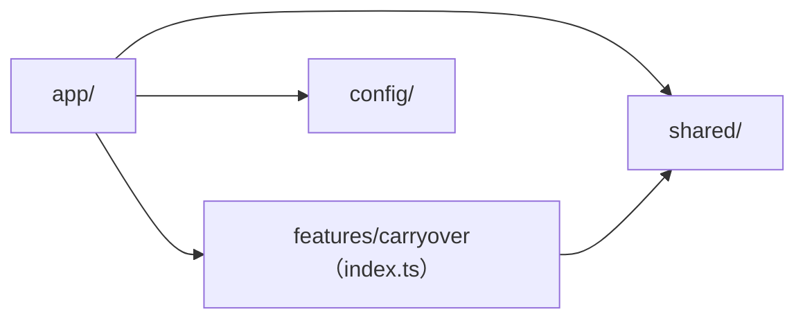

# 01. 全体構成

[設計書の目次へ戻る](../design.md)

## ディレクトリ構成

Java 側の「機能パッケージ + 層」に合わせ、`frontend/src/` も機能（feature）単位で構成します。

```text
frontend/
  docs/                      # 設計書（本書）
  scripts/copy-data.mjs      # docs/data を public/data にコピー（dev / build の前に自動実行）
  public/data/               # docs/data のコピー（Git で管理しない）
  out/                       # 静的エクスポートの出力（Git で管理しない）
  src/
    app/                     # ルーティング専用
      layout.tsx             # 共通レイアウト（Header / PageContainer / Footer）
      page.tsx               # トップページ（CarryoverDashboard を表示）
      not-found.tsx          # 404 ページ
    features/
      carryover/             # 持ち越しの機能
        index.ts             # 機能の公開窓口
        api/                 # データ取得（fetchSummary）
        model/               # 型と zod スキーマ、表示条件の型
        constants/           # ラベル、配色、期間のプリセット
        lib/                 # 純粋関数（集計、グラフ用データ、文言）
        hooks/               # 状態管理とデータ読み込みのフック
        components/          # 機能の画面部品
        testing/             # テスト用のデータ（fixtures）
    shared/
      components/ui/         # Panel、Select、Button、Card、DateRange、Swatch
      components/layout/     # Header、Footer、PageContainer
      lib/                   # assetPath、数値の丸めと書式化
      hooks/                 # useAsync
      types/                 # LoadState
    config/site.ts           # サイト名、リポジトリの URL など
    styles/globals.css       # CSS 変数と要素の共通スタイル
```

各フォルダの役割は次のとおりです。

| フォルダ    | 役割                                                                                    |
| ----------- | --------------------------------------------------------------------------------------- |
| `app/`      | Next.js のルーティング。機能を呼び出すだけで、ロジックを置かない                        |
| `features/` | 機能ごとの画面とロジック。機能の外へは `index.ts` で公開したものだけを出す              |
| `shared/`   | 機能に依存しない汎用の部品・関数・型                                                    |
| `config/`   | サイト全体の設定値                                                                      |
| `styles/`   | 全体に効くスタイル（CSS 変数、要素の共通スタイル）。部品のスタイルは CSS Modules に置く |

## 依存の向き

依存は `app` -> `features` -> `shared` の一方向だけにします。



- `shared/`・`config/` から `features/` を import しない
- 機能の内部（`@/features/<機能名>/xxx`）を機能の外から import しない。必ず `@/features/<機能名>`（`index.ts`）を経由する
- 同じ機能の中では相対パスで import する
- 機能の外のファイルは `@/`（`src/` を指すパスエイリアス）で import する
- `app/` はどこからも import しない

これらは [eslint.config.mjs](../../eslint.config.mjs) の `no-restricted-imports` でチェックします。

| 対象ファイル                     | 禁止する import                |
| -------------------------------- | ------------------------------ |
| `src/app/**`                     | `@/features/*/*`（機能の内部） |
| `src/features/**`                | `@/app`、`@/features/*/*`      |
| `src/shared/**`、`src/config/**` | `@/app`、`@/features`          |

### 機能の公開窓口

[features/carryover/index.ts](../../src/features/carryover/index.ts) で公開しているものは次の 3 つです。

| 名前                 | 種類           | 利用箇所                                              |
| -------------------- | -------------- | ----------------------------------------------------- |
| `CarryoverDashboard` | コンポーネント | `app/page.tsx`                                        |
| `SUMMARY_PATH`       | 定数           | `app/layout.tsx`（Footer の summary.json へのリンク） |
| `Summary`            | 型             | 機能の外で型が必要な場合                              |

### コンポーネントのフォルダ構成

コンポーネントは 1 フォルダにまとめます。

```text
Xxx/
  Xxx.tsx          # コンポーネント本体
  Xxx.module.css   # スタイル（CSS Modules）
  Xxx.test.tsx     # テスト（Testing Library）
  index.ts         # export
```

## 静的エクスポート

[next.config.ts](../../next.config.ts) で次のように設定しています。

| 設定                        | 値                                     | 理由                                                            |
| --------------------------- | -------------------------------------- | --------------------------------------------------------------- |
| `output`                    | `'export'`                             | GitHub Pages で配信できる静的ファイル（`out/`）を出力する       |
| `basePath`                  | 環境変数 `PAGES_BASE_PATH`（既定は空） | プロジェクトサイトは `/<リポジトリ名>` 配下で配信される         |
| `trailingSlash`             | `true`                                 | `xxx/index.html` の形で出力し、Pages でそのまま開けるようにする |
| `images.unoptimized`        | `true`                                 | 静的エクスポートでは画像最適化を使えない                        |
| `env.NEXT_PUBLIC_BASE_PATH` | `basePath` と同じ値                    | クライアント側の `assetPath()` で basePath を参照する           |
| `agentRules`                | `false`                                | エージェント向けのルールはリポジトリ直下の AGENTS.md にまとめる |

静的エクスポートのため、次の機能は使いません。

- API Routes、Route Handlers
- `cookies()`・`headers()` などの動的機能
- 画像最適化（`next/image` の最適化）

### basePath と assetPath

`public/` のファイルを `fetch` などで参照するときは、[shared/lib/assetPath.ts](../../src/shared/lib/assetPath.ts) の `assetPath()` で basePath を付けます。

```ts
assetPath('/data/summary.json');
// ローカル（basePath なし）: '/data/summary.json'
// GitHub Pages:            '/daily-tasks-git/data/summary.json'
```

- basePath の末尾の `/` は取り除く
- パスの先頭に `/` がない場合は補う
- `next/link` の `href` は Next.js が basePath を付けるため、`assetPath()` は不要

## レンダリング方式

- `app/layout.tsx`・`app/page.tsx`・`app/not-found.tsx` はサーバーコンポーネントとして、ビルド時に HTML を出力します
- `CarryoverDashboard` 以下のデータを扱うコンポーネントとフックは `'use client'` を付け、ブラウザで `summary.json` を読み込んでから描画します
- そのため、データは公開後も `docs/data/` の更新（再デプロイ）だけで最新になります。`fetch` は `cache: 'no-cache'` で取得します
