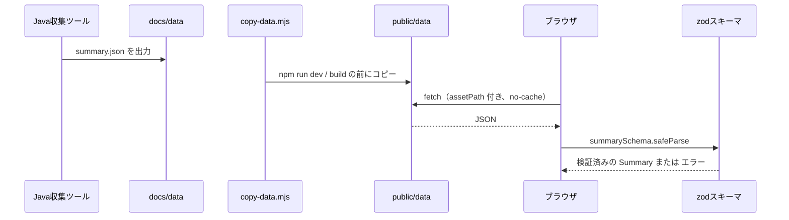
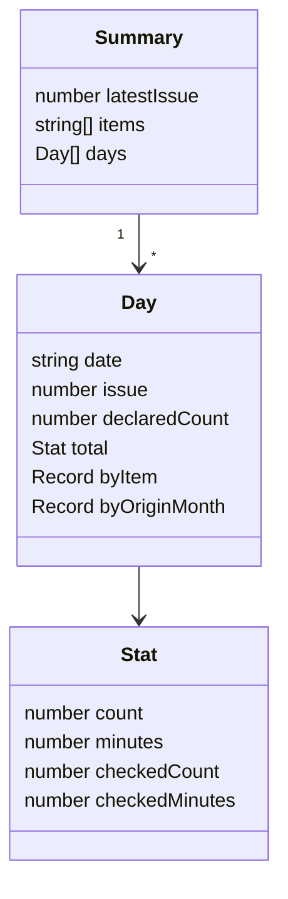

# 02. データ設計

[設計書の目次へ戻る](../design.md)

## 基本方針

- 画面が扱うデータは `summary.json`（日別集計）だけです
- データ（`docs/data/`）を作成・変更するのは Java の収集ツールだけです。フロントエンドは読み取りだけを行います
- `summary.json` は実行時に zod スキーマで検証し、形式が想定と違う場合は画面にエラーを表示します

## データの流れ



### データのコピー

[scripts/copy-data.mjs](../../scripts/copy-data.mjs) は `npm run dev` と `npm run build` の前（`predev` / `prebuild`）に自動で実行されます。

1. リポジトリ直下の `docs/data/` があることを確認する。ない場合はエラーメッセージを出して終了コード 1 で終わる
2. `frontend/public/data/` を削除する
3. `docs/data/` を `frontend/public/data/` にまるごとコピーする

`public/data/` はコピーなので Git では管理しません。

## summary.json のスキーマ

スキーマは [features/carryover/model/summary.ts](../../src/features/carryover/model/summary.ts) で定義し、型は `z.infer` で導出します（`Summary` / `Day` / `Stat`）。



### Summary（ルート）

| 項目          | 型           | 説明                                                     |
| ------------- | ------------ | -------------------------------------------------------- |
| `latestIssue` | 整数         | 集計に含まれる最新の Issue 番号                          |
| `items`       | 文字列の配列 | 項目名の一覧。この並び順で色を割り当て、選択肢を表示する |
| `days`        | `Day` の配列 | 日別の集計。日付の昇順                                   |

### Day（1 日分の集計）

| 項目            | 型                     | 説明                                                               |
| --------------- | ---------------------- | ------------------------------------------------------------------ |
| `date`          | 文字列（`YYYY-MM-DD`） | その日の残の日付（Issue タイトルの日付）。正規表現で形式を検証する |
| `issue`         | 整数                   | その日の Issue 番号                                                |
| `declaredCount` | 数値または `null`      | Issue 本文の `残：N`（検証用）。画面では使わない                   |
| `total`         | `Stat`                 | その日の全項目の合計                                               |
| `byItem`        | 項目名 -> `Stat`       | 項目ごとの集計。その日に存在しない項目はキーがない                 |
| `byOriginMonth` | `YYYY-MM` -> `Stat`    | 持ち越し元の月（項目に付いた日付の月）ごとの集計                   |

### Stat（件数と残り時間）

| 項目             | 型   | 説明                                     |
| ---------------- | ---- | ---------------------------------------- |
| `count`          | 数値 | 件数（チェック済みを含む）               |
| `minutes`        | 数値 | 残り時間の合計（分、チェック済みを含む） |
| `checkedCount`   | 数値 | そのうちチェック済み（`- [x]`）の件数    |
| `checkedMinutes` | 数値 | そのうちチェック済みの残り時間（分）     |

未チェックの値は `count - checkedCount`（時間は `minutes - checkedMinutes`）で求めます。

### 例

```json
{
  "latestIssue": 3,
  "items": ["英語", "数学"],
  "days": [
    {
      "date": "2026-01-31",
      "issue": 2,
      "declaredCount": null,
      "total": { "count": 3, "minutes": 75, "checkedCount": 1, "checkedMinutes": 30 },
      "byItem": {
        "英語": { "count": 1, "minutes": 15, "checkedCount": 0, "checkedMinutes": 0 },
        "数学": { "count": 2, "minutes": 60, "checkedCount": 1, "checkedMinutes": 30 }
      },
      "byOriginMonth": {
        "2026-01": { "count": 3, "minutes": 75, "checkedCount": 1, "checkedMinutes": 30 }
      }
    }
  ]
}
```

## 取得と検証

[features/carryover/api/fetchSummary.ts](../../src/features/carryover/api/fetchSummary.ts) の `fetchSummary()` が取得と検証を行います。

| 項目       | 内容                                                               |
| ---------- | ------------------------------------------------------------------ |
| URL        | `assetPath(SUMMARY_PATH)`（`SUMMARY_PATH` = `/data/summary.json`） |
| キャッシュ | `cache: 'no-cache'`（更新後のデータを確実に取得する）              |
| 引数       | `fetcher`（既定は `fetch`）。テストでは差し替える                  |
|            | `signal`（省略可）。`fetch` に渡し、取得を中断できるようにする     |
| 戻り値     | 検証済みの `Summary`                                               |

次の場合は `Error` を投げます。

| 条件                         | メッセージ                                                  |
| ---------------------------- | ----------------------------------------------------------- |
| HTTP のステータスが 2xx 以外 | `summary.json の取得に失敗しました（<ステータス>）`         |
| zod の検証に失敗             | `summary.json の形式が想定と異なります: <最初の問題の内容>` |

中断された場合は `fetch` が `AbortError` を投げますが、`useAsync` は中断後の結果を捨てるため画面には表示しません。それ以外の投げられたエラーは `useAsync` が `LoadState` の `error` に変換し、`CarryoverDashboard` が「データを読み込めませんでした」のパネルにメッセージを表示します（[03. 画面設計](03-screen.md)）。

## 形式を変更する場合

`summary.json` の形式を変える場合は、次をあわせて行います。

1. Java 側の出力を変更し、全件モード（`--full`）で再生成できることを確認する
2. `model/summary.ts` のスキーマを変更する
3. `testing/fixtures.ts` のテスト用データと、関係するテストを更新する
4. 本章のスキーマの表を更新する
