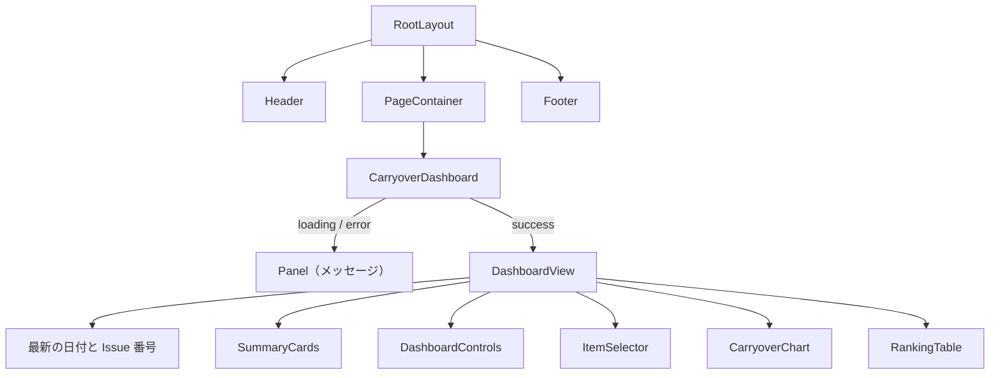

# 03. 画面設計

[設計書の目次へ戻る](../design.md)

## 画面一覧

| ルート   | ファイル                                         | 内容                                         |
| -------- | ------------------------------------------------ | -------------------------------------------- |
| `/`      | [app/page.tsx](../../src/app/page.tsx)           | 持ち越しの推移（`CarryoverDashboard`）       |
| 該当なし | [app/not-found.tsx](../../src/app/not-found.tsx) | 「ページが見つかりません」とトップへのリンク |

すべてのページは [app/layout.tsx](../../src/app/layout.tsx) の共通レイアウト（Header / PageContainer / Footer）の中に表示します。ページのタイトルは `siteConfig.title | siteConfig.name`（`持ち越しの推移 | daily-tasks`）です（[config/site.ts](../../src/config/site.ts)）。

## 画面構成（トップページ）

```text
+------------------------------------------------------------+
| Header: 持ち越しの推移 / 説明文                              |
+------------------------------------------------------------+
| 最新: 2026-10-07（#NNN）                                     |
| SummaryCards: [最新の残（件数）][最新の残り時間][期間平均]   |
|               [最大][最小]                                   |
| DashboardControls: 表示 / 指標 / 集計 / 対象 / 期間 + プリセット |
| ItemSelector: [すべて選択][すべて解除] □項目A □項目B ...     |
| CarryoverChart: 見出し / 補足 / グラフ                        |
| RankingTable: 項目ごとの集計（選択した期間）                 |
+------------------------------------------------------------+
| Footer: データ: <リポジトリ> の Issue ／ summary.json         |
+------------------------------------------------------------+
```



### 読み込みの状態ごとの表示

| 状態      | 表示                                                                                       |
| --------- | ------------------------------------------------------------------------------------------ |
| `loading` | パネルに「データを読み込んでいます…」                                                      |
| `error`   | 見出し「データを読み込めませんでした」と、エラーメッセージ（[02. データ設計](02-data.md)） |
| `success` | ダッシュボード本体（`DashboardView`）                                                      |

### 各領域

| 領域              | 内容                                                                         |
| ----------------- | ---------------------------------------------------------------------------- |
| 最新情報          | `summary.days` の最後の日付と `latestIssue`。データが 0 日の場合は表示しない |
| SummaryCards      | 選択中の期間・項目・対象で計算した 5 枚のカード（下表）                      |
| DashboardControls | 表示条件の切り替え。期間の入力欄の範囲はデータの最初の日から最後の日まで     |
| ItemSelector      | 項目ごとのチェックボックスと色見本。「すべて選択」「すべて解除」ボタン       |
| CarryoverChart    | 表示の種類に応じたグラフ。見出しと補足は表示条件から作る                     |
| RankingTable      | 選択中の項目ごとの最新・平均・最大・最小・合計                               |

#### SummaryCards

期間内の最後の日を「最新」とします。期間内にデータがない場合は「データなし」のカード 1 枚だけを表示し、補足に「期間や項目の選択を見直してください」と出します。

| カード           | 値                                 | 補足                                               |
| ---------------- | ---------------------------------- | -------------------------------------------------- |
| 最新の残（件数） | 最新日の件数（指標に関係なく件数） | 日付と Issue 番号。前日がある場合は前日比（件数）  |
| 最新の残り時間   | 最新日の残り時間（時間）           | 同じ値を分で表示                                   |
| 期間平均（指標） | 選択した指標の 1 日あたりの平均    | 期間の日数                                         |
| 最大（指標）     | 選択した指標の期間内の最大         | 最大になった日付（同じ値が複数ある場合は最初の日） |
| 最小（指標）     | 選択した指標の期間内の最小         | 最小になった日付（同じ値が複数ある場合は最初の日） |

#### RankingTable

- 行は選択中の項目だけです
- 並び順は「最新の値の大きい順」、同じ場合は「平均の大きい順」です
- 値は指標に応じて丸めて書式化します（[04. モジュール設計](04-modules.md) の丸めと書式化）

## 表示条件

表示条件は [features/carryover/model/options.ts](../../src/features/carryover/model/options.ts) の `DashboardOptions` で表します。

| 項目 | キー          | 選択肢                                                                           | 既定値  |
| ---- | ------------- | -------------------------------------------------------------------------------- | ------- |
| 表示 | `view`        | `VIEWS`（下表）                                                                  | `daily` |
| 指標 | `metric`      | `count`（件数）、`minutes`（分）、`hours`（時間）                                | `count` |
| 集計 | `agg`         | `avg`（平均）、`sum`（合計）、`max`（最大）、`min`（最小）、`last`（期間末の値） | `avg`   |
| 対象 | `target`      | `all`（すべて）、`unchecked`（未チェックのみ）、`checked`（チェック済みのみ）    | `all`   |
| 期間 | `from` / `to` | `YYYY-MM-DD`（両端を含む）。空文字は制限なし                                     | 全期間  |

### 表示の種類

| `view`        | ラベル               | グラフ                     | 横軸            | 集計の選択 | 項目の選択           |
| ------------- | -------------------- | -------------------------- | --------------- | ---------- | -------------------- |
| `daily`       | 日別推移（全体）     | 面グラフ（1 系列）         | 日付            | 使わない   | 合計に反映           |
| `dailyItem`   | 日別推移（項目ごと） | 積み上げ面グラフ           | 日付            | 使わない   | 系列に反映           |
| `monthly`     | 月ごと（全体）       | 棒グラフ（1 系列）         | 月（`YYYY-MM`） | 使う       | 合計に反映           |
| `monthlyItem` | 月ごと（項目ごと）   | 積み上げ棒グラフ           | 月（`YYYY-MM`） | 使う       | 系列に反映           |
| `item`        | 項目ごと             | 横棒グラフ（値の大きい順） | 項目            | 使う       | 行に反映             |
| `originMonth` | 持ち越し元の月ごと   | 棒グラフ（1 系列）         | 持ち越し元の月  | 使う       | 反映しない（全項目） |

- 集計を使う表示（`AGG_VIEWS`）以外では、「集計」のセレクトボックスを無効にします
- 集計は日ごとの残をもとに計算します。たとえば月ごとの平均は「その月の 1 日あたりの残」です
- `originMonth` は `byOriginMonth` を使うため、項目の選択に関係なく全項目が対象です

### グラフの見出しと補足

見出しは `表示：指標・集計（対象）` の形式です。集計を使わない表示では `・集計` を省きます。

```text
日別推移（全体）：件数（すべて）
月ごと（項目ごと）：残り時間（時間）・平均（未チェックのみ）
```

補足は次の条件で表示します。

| 条件                                 | 補足                                                                      |
| ------------------------------------ | ------------------------------------------------------------------------- |
| `view` が `originMonth`              | 持ち越し元の月ごとの表示は項目の選択に関係なく全項目を対象にします。      |
| 集計を使う表示（`originMonth` 以外） | 集計は日ごとの残をもとに計算します（例: 平均は期間内の 1 日あたりの残）。 |

### ツールチップと凡例

- ツールチップは系列を値の大きい順に並べます
- 積み上げ表示で 2 系列以上ある場合は、ツールチップに合計も表示します
- 凡例は系列が 2 つ以上ある場合だけ表示します
- 横棒グラフ（`item`）では、棒ごとに項目の色を使い、ツールチップには項目名を表示します

### 期間

- 開始日と終了日を日付の入力欄で指定します（入力できる範囲はデータの最初の日から最後の日まで）
- プリセットボタンで期間をまとめて設定できます

| ボタン   | 期間                                         |
| -------- | -------------------------------------------- |
| 全期間   | データの最初の日から最後の日まで             |
| 直近30日 | 最後の日を終わりとする 30 日間（両端を含む） |
| 直近90日 | 最後の日を終わりとする 90 日間（両端を含む） |

### 項目の選択

- 初期状態ではすべての項目を選択します
- 選択した項目は、元の並び順（`summary.items` の順）を保ってグラフと表に使います
- 色は `summary.items` の並び順でパレットから割り当てます。選択を変えても項目の色は変わりません

## URL クエリによる初期値

URL のクエリ文字列で、表示条件の初期値を指定できます（[lib/queryOptions.ts](../../src/features/carryover/lib/queryOptions.ts)）。

```text
https://<ユーザー>.github.io/daily-tasks-git/?view=monthly&metric=hours
```

| キー     | 指定できる値                                                               |
| -------- | -------------------------------------------------------------------------- |
| `view`   | `daily` / `dailyItem` / `monthly` / `monthlyItem` / `item` / `originMonth` |
| `metric` | `count` / `minutes` / `hours`                                              |
| `agg`    | `avg` / `sum` / `max` / `min` / `last`                                     |
| `target` | `all` / `unchecked` / `checked`                                            |

- 想定外の値は無視し、既定値を使います
- 期間（`from` / `to`）と項目の選択はクエリで指定できません
- クエリは最初の描画時に 1 回だけ読み取ります。画面で条件を変えても URL は更新しません

## スタイル

- 全体の色・角丸は [styles/globals.css](../../src/styles/globals.css) の CSS 変数で定義します（`--bg`、`--panel`、`--border`、`--text`、`--muted`、`--accent`、`--radius`）
- `select`・`input[type='date']`・`button` の共通の見た目も `globals.css` で定義します
- 部品ごとのスタイルは各コンポーネントの `*.module.css` に置きます
