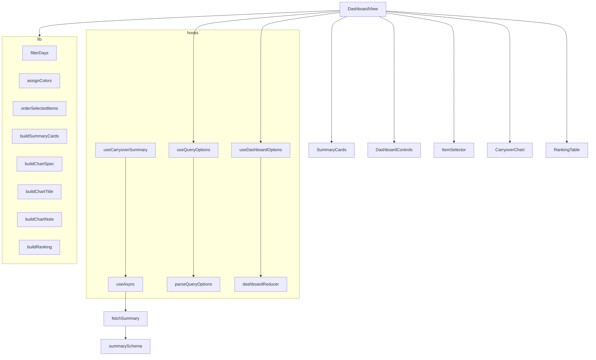

# 04. モジュール設計

[設計書の目次へ戻る](../design.md)

## 処理の全体像

`CarryoverDashboard` がデータを読み込み、`DashboardView` が表示条件の状態を持ちます。表示用のデータはすべて `lib/` の純粋関数で作り、`useMemo` でメモ化してから各コンポーネントに渡します。



`DashboardView` での計算の順序は次のとおりです。

1. `assignColors(summary.items)`: 項目ごとの色
2. `orderSelectedItems(summary.items, selected)`: 選択中の項目（元の並び順）
3. `filterDays(summary.days, from, to)`: 期間内の日別データ
4. `buildSummaryCards` / `buildChartSpec` / `buildRanking`: 2 と 3 から表示用のデータを作る
5. `buildChartTitle` / `buildChartNote`: 表示条件からグラフの見出しと補足を作る

## 状態管理

### 読み込みの状態

[shared/types/loadState.ts](../../src/shared/types/loadState.ts) の `LoadState<T>` で表します。

```ts
type LoadState<T> = { status: 'loading' } | { status: 'success'; data: T } | { status: 'error'; error: Error };
```

### 画面の状態

[hooks/dashboardReducer.ts](../../src/features/carryover/hooks/dashboardReducer.ts) の `DashboardState` で表し、`useReducer` で管理します。

| 項目       | 型                    | 説明           |
| ---------- | --------------------- | -------------- |
| `options`  | `DashboardOptions`    | 表示条件       |
| `selected` | `ReadonlySet<string>` | 選択中の項目名 |

初期状態は `createInitialState(summary, initialOptions)` で作ります。優先順位は「URL クエリの値」>「全期間の期間」>「`DEFAULT_OPTIONS`」です。項目はすべて選択します。

| アクション   | 引数                               | 処理                              |
| ------------ | ---------------------------------- | --------------------------------- |
| `setOptions` | `patch: Partial<DashboardOptions>` | 表示条件の一部を上書きする        |
| `setPeriod`  | `period: Period`                   | 期間（`from` / `to`）を上書きする |
| `toggleItem` | `item: string`                     | 項目の選択を切り替える            |
| `selectAll`  | `items: readonly string[]`         | 指定した項目をすべて選択する      |
| `selectNone` | なし                               | 選択をすべて解除する              |

reducer は状態を直接変更せず、常に新しいオブジェクト（`selected` は新しい `Set`）を返します。

## フック

| フック                | 場所                                                                                      | 役割                                                                                                               |
| --------------------- | ----------------------------------------------------------------------------------------- | ------------------------------------------------------------------------------------------------------------------ |
| `useAsync`            | [shared/hooks/useAsync.ts](../../src/shared/hooks/useAsync.ts)                            | 非同期処理をマウント時に実行し `LoadState` を返す。アンマウント後の結果は捨てる。Error 以外の失敗は `Error` に包む |
| `useCarryoverSummary` | [hooks/useCarryoverSummary.ts](../../src/features/carryover/hooks/useCarryoverSummary.ts) | `useAsync(fetchSummary)` で summary.json を読み込む。loader はモジュールの定数にして参照を安定させる               |
| `useQueryOptions`     | [hooks/useQueryOptions.ts](../../src/features/carryover/hooks/useQueryOptions.ts)         | 初回の描画時に 1 回だけ URL クエリを読み取る。`window` がない環境では空の条件を返す                                |
| `useDashboardOptions` | [hooks/useDashboardOptions.ts](../../src/features/carryover/hooks/useDashboardOptions.ts) | reducer を包み、`options`・`selected` と操作関数を返す                                                             |

`useDashboardOptions` が返す操作関数は次のとおりです。すべて `useCallback` で参照を安定させています。

| 関数          | 内容                                                         |
| ------------- | ------------------------------------------------------------ |
| `setOptions`  | 表示条件の一部を変更する                                     |
| `setPeriod`   | 期間を変更する                                               |
| `applyPreset` | 日数（0 は全期間）から `presetPeriod` で期間を作って設定する |
| `toggleItem`  | 項目の選択を切り替える                                       |
| `selectAll`   | `summary.items` をすべて選択する                             |
| `selectNone`  | 選択をすべて解除する                                         |

## lib（純粋関数）

計算ロジックは `features/carryover/lib/` の純粋関数にまとめ、コンポーネントから切り離します。外部の状態や DOM に依存しないため、Vitest で単体テストします。

### calc.ts（基本の計算）

| 関数                   | 内容                                                                                       |
| ---------------------- | ------------------------------------------------------------------------------------------ |
| `statValue`            | `Stat` から指標と対象に応じた値を取り出す。`Stat` がない場合は 0。`hours` は分を 60 で割る |
| `dayItemValue`         | ある日のある項目の値（`byItem` に項目がない場合は 0）                                      |
| `dayTotal`             | ある日の、指定した項目の合計値                                                             |
| `aggregate`            | 値の一覧を `avg` / `sum` / `max` / `min` / `last` で集計する。空の場合は 0                 |
| `roundMetric`          | 丸め。`hours` は小数 2 桁、それ以外は 1 桁                                                 |
| `formatMetric`         | 書式化（日本語ロケール）。`minutes` は整数、それ以外は小数 1 桁                            |
| `formatMetricWithUnit` | 丸めと書式化を行い、単位（件 / 分 / 時間）を付ける                                         |
| `groupByMonth`         | 日別データを月（`YYYY-MM`）ごとにまとめる（出現順を保つ）                                  |
| `filterDays`           | 期間（両端を含む）で絞り込む。空文字は制限なし                                             |
| `assignColors`         | 項目の並び順にパレットの色を割り当てる（パレットの数を超えたら先頭から繰り返す）           |
| `orderSelectedItems`   | 元の並び順を保ったまま、選択した項目だけを返す                                             |

対象（`target`）ごとの値の取り出し方は次のとおりです。

| `target`    | 件数                   | 時間                       |
| ----------- | ---------------------- | -------------------------- |
| `all`       | `count`                | `minutes`                  |
| `unchecked` | `count - checkedCount` | `minutes - checkedMinutes` |
| `checked`   | `checkedCount`         | `checkedMinutes`           |

### chartData.ts（グラフの定義）

`buildChartSpec(days, items, colors, options)` が、表示の種類ごとの作成関数を呼び分けて `ChartSpec` を返します。

```ts
type ChartSpec = {
  kind: 'area' | 'bar';
  stacked: boolean;
  horizontal: boolean;
  rows: ChartRow[]; // 横軸の 1 目盛りごとの行。label と系列キーごとの値
  series: ChartSeries[]; // key（s0, s1, ...）、label、color
};
```

- 系列のキーは項目名ではなく連番（`s0`、`s1`、...）にします。Recharts の `dataKey` は `.` をパスとして扱うため、項目名をそのまま使うと値を取り出せない場合があるためです
- 値は `roundMetric` で丸めてから行に入れます
- 1 系列の表示では `PRIMARY_COLOR`（`originMonth` は `ORIGIN_MONTH_COLOR`）を、項目ごとの表示では項目の色を使います
- `item` は値の大きい順に並べ、行ごとに項目の色（`row.color`）を持たせます
- `originMonth` の横軸は、期間内に現れた持ち越し元の月を昇順に並べたものです

### chartText.ts（グラフの文言）

| 関数              | 内容                                           |
| ----------------- | ---------------------------------------------- |
| `buildChartTitle` | グラフの見出し（[03. 画面設計](03-screen.md)） |
| `buildChartNote`  | グラフの補足。該当しない場合は空文字           |

### その他

| ファイル          | 関数                | 内容                                                                                                      |
| ----------------- | ------------------- | --------------------------------------------------------------------------------------------------------- |
| `period.ts`       | `presetPeriod`      | 最新日を終わりとする直近 N 日間の期間。N が 0 なら全期間。データがなければ空の期間。日付は UTC で計算する |
| `queryOptions.ts` | `parseQueryOptions` | クエリ文字列から `view` / `metric` / `agg` / `target` を読み取る。想定外の値は無視する                    |
| `ranking.ts`      | `buildRanking`      | 項目ごとの最新・平均・最大・最小・合計。最新の大きい順、同じなら平均の大きい順                            |
| `summaryCards.ts` | `buildSummaryCards` | サマリカードの内容（ラベル・値・補足）。データがなければ「データなし」の 1 枚                             |

## コンポーネント

### 機能のコンポーネント（features/carryover/components）

| コンポーネント       | 主な props                                                                       | 責務                                                                         |
| -------------------- | -------------------------------------------------------------------------------- | ---------------------------------------------------------------------------- |
| `CarryoverDashboard` | なし                                                                             | summary.json を読み込み、状態に応じてメッセージか `DashboardView` を表示する |
| `DashboardView`      | `summary`                                                                        | 表示条件の状態を持ち、表示用のデータを作って各部品に渡す                     |
| `SummaryCards`       | `cards`                                                                          | サマリカードを並べる（`aria-label="サマリ"`）                                |
| `DashboardControls`  | `options`、`minDate`、`maxDate`、`onOptionsChange`、`onPeriodChange`、`onPreset` | 表示・指標・集計・対象のセレクトボックス、期間の入力欄、プリセットボタン     |
| `ItemSelector`       | `items`、`colors`、`selected`、`onToggle`、`onSelectAll`、`onSelectNone`         | 項目のチェックボックスと一括選択・解除                                       |
| `CarryoverChart`     | `title`、`note`、`spec`、`metric`                                                | `ChartSpec` から Recharts の面グラフ・棒グラフ・横棒グラフを描画する         |
| `ChartTooltip`       | `active`、`label`、`entries`、`metric`、`stacked`                                | 値の大きい順のツールチップ。積み上げで 2 系列以上なら合計も出す              |
| `RankingTable`       | `rows`、`colors`、`metric`                                                       | 項目ごとの集計表                                                             |

コンポーネントは表示とイベントの受け渡しだけを行い、計算は `lib/` の関数に任せます。状態を持つのは `DashboardView`（`useDashboardOptions`）だけです。

### 共通の部品（shared/components）

| コンポーネント  | 場所                   | props                                                | 内容                                                       |
| --------------- | ---------------------- | ---------------------------------------------------- | ---------------------------------------------------------- |
| `Panel`         | `ui/Panel`             | `title?`、`note?`、`className?`、`children`          | 枠付きの区画。見出しと補足は任意                           |
| `Select`        | `ui/Select`            | `label`、`value`、`options`、`onChange`、`disabled?` | ラベル付きのセレクトボックス（値の型をジェネリクスで保つ） |
| `Button`        | `ui/Button`            | `button` 要素の属性                                  | 共通のボタン。`type` の既定値は `button`                   |
| `Card`          | `ui/Card`              | `label`、`value`、`sub?`                             | ラベル・値・補足を縦に並べるカード                         |
| `DateRange`     | `ui/DateRange`         | `from`、`to`、`min?`、`max?`、`onChange`             | 開始日と終了日の入力欄                                     |
| `Swatch`        | `ui/Swatch`            | `color`                                              | 系列の色を示す小さな四角（`aria-hidden`）                  |
| `Header`        | `layout/Header`        | `title`、`description?`                              | ページ上部の見出し                                         |
| `Footer`        | `layout/Footer`        | `prefix?`、`links`                                   | ページ下部のリンク一覧（`／` 区切り）                      |
| `PageContainer` | `layout/PageContainer` | `children`                                           | 本文（`main` 要素）の幅と余白をそろえる                    |

### 共通の関数（shared/lib）

| 関数           | 内容                                                                      |
| -------------- | ------------------------------------------------------------------------- |
| `assetPath`    | basePath を付けた静的ファイルの URL（[01. 全体構成](01-architecture.md)） |
| `roundTo`      | 指定した小数の桁数で四捨五入する                                          |
| `formatNumber` | 日本語ロケールで書式化する。整数以外は指定した桁数に丸める                |

## 定数（features/carryover/constants）

| ファイル     | 定数                   | 内容                                                     |
| ------------ | ---------------------- | -------------------------------------------------------- |
| `labels.ts`  | `VIEW_LABELS`          | 表示の種類のラベル                                       |
|              | `METRIC_LABELS`        | 指標のラベル（グラフの軸・見出し用）                     |
|              | `METRIC_OPTION_LABELS` | 指標のラベル（セレクトボックス用。件数は「件数（残）」） |
|              | `AGG_LABELS`           | 集計方法のラベル                                         |
|              | `TARGET_LABELS`        | 対象のラベル                                             |
|              | `UNIT_LABELS`          | 単位（件 / 分 / 時間）                                   |
|              | `PERIOD_PRESETS`       | 期間のプリセット（全期間 / 直近30日 / 直近90日）         |
| `palette.ts` | `PALETTE`              | 系列の色（16 色）                                        |
|              | `PRIMARY_COLOR`        | 1 系列の表示の色（`PALETTE[0]`）                         |
|              | `ORIGIN_MONTH_COLOR`   | 持ち越し元の月ごとの表示の色（`PALETTE[4]`）             |

ラベルは `Record<View, string>` のように選択肢の型をキーにしているため、選択肢を追加するとラベルの定義漏れが型エラーになります。
