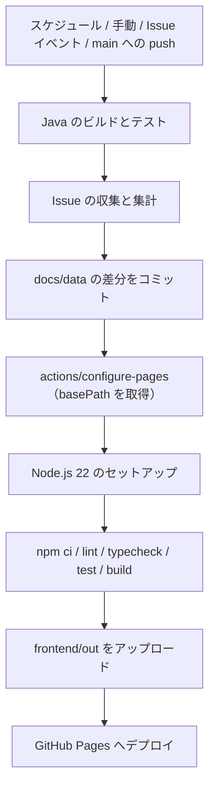

# 05. 品質・運用

[設計書の目次へ戻る](../design.md)

## テスト

### 方針

| 対象                       | ツール                   | 内容                                                           |
| -------------------------- | ------------------------ | -------------------------------------------------------------- |
| `lib/` の純粋関数、reducer | Vitest                   | 入力と出力の組み合わせを検証する                               |
| `api/`（`fetchSummary`）   | Vitest                   | `fetcher` を差し替え、成功・HTTP エラー・形式エラーを検証する  |
| フック（`useAsync`）       | Vitest + Testing Library | 成功・失敗・アンマウント後の状態を検証する                     |
| コンポーネント             | Vitest + Testing Library | 表示内容と、操作（`user-event`）に対するコールバックを検証する |

- テストファイルは対象と同じフォルダに `*.test.ts(x)` で置きます
- テスト用のデータは [features/carryover/testing/fixtures.ts](../../src/features/carryover/testing/fixtures.ts) の関数で作ります

| 関数            | 内容                                           |
| --------------- | ---------------------------------------------- |
| `stat`          | `Stat` を作る（チェック済みの値は省略時 0）    |
| `day`           | `Day` を作る。`total` は `byItem` の合計にする |
| `sampleSummary` | 3 日分・2 項目（英語、数学）の `Summary`       |

### 設定

[vitest.config.ts](../../vitest.config.ts) と [vitest.setup.ts](../../vitest.setup.ts) で次のように設定しています。

- 環境は `jsdom`、`globals: true`
- 対象は `src/**/*.test.{ts,tsx}`
- `tsconfig` のパスエイリアス（`@/`）を解決する
- CSS Modules のクラス名はスコープを付けない（`non-scoped`）ため、テストでクラス名を指定できる
- `@testing-library/jest-dom` のマッチャーを読み込み、各テストの後に `cleanup()` を行う
- Recharts の `ResponsiveContainer` のため、jsdom にない `ResizeObserver` の代替を用意する

## 静的解析・整形

| ツール     | 設定ファイル                                 | 内容                                                                                                              |
| ---------- | -------------------------------------------- | ----------------------------------------------------------------------------------------------------------------- |
| ESLint     | [eslint.config.mjs](../../eslint.config.mjs) | `eslint-config-next`（core-web-vitals、typescript）と、依存の向きのチェック（[01. 全体構成](01-architecture.md)） |
| TypeScript | [tsconfig.json](../../tsconfig.json)         | `tsc --noEmit` で型チェックする                                                                                   |
| Prettier   | [.prettierrc](../../.prettierrc)             | シングルクォート、1 行 120 文字、末尾のカンマあり                                                                 |

ESLint と Prettier は `.next/`・`out/`・`public/data/`・`coverage/` を対象外にしています。

## npm スクリプト

`frontend/` で実行します。

| コマンド               | 内容                                                                 |
| ---------------------- | -------------------------------------------------------------------- |
| `npm install`          | 依存のインストール                                                   |
| `npm run dev`          | データをコピーしてから開発サーバーを起動（`http://localhost:3000/`） |
| `npm run build`        | データをコピーしてから静的エクスポート（`out/`）                     |
| `npm run copy-data`    | `docs/data` を `public/data` にコピーする                            |
| `npm run lint`         | ESLint（依存の向きのチェックを含む）                                 |
| `npm run typecheck`    | TypeScript の型チェック                                              |
| `npm test`             | Vitest（1 回実行）                                                   |
| `npm run test:watch`   | Vitest（監視モード）                                                 |
| `npm run format`       | Prettier で整形する                                                  |
| `npm run format:check` | Prettier の整形を確認する                                            |

## ビルドとデプロイ

GitHub Actions の [update-carryover.yml](../../../.github/workflows/update-carryover.yml) で、データの更新から Pages へのデプロイまでを行います。

- 画面のビルドでは、`actions/configure-pages` の出力（`base_path`）を環境変数 `PAGES_BASE_PATH` で Next.js に渡します
- lint・型チェック・テストのどれかが失敗すると、デプロイは行いません
- GitHub Pages の Source は「GitHub Actions」にします

## 変更時の確認

画面を変更した場合は、次をすべて確認します。

1. `npm run lint`
2. `npm run typecheck`
3. `npm test`
4. `npm run build`
5. `npm run dev` で表示と切り替え（表示・指標・集計・対象・期間・項目の選択）を確認する
6. 本設計書の関係する章を更新する

## 新しい機能を追加する手順

1. `src/features/<機能名>/` を `carryover` と同じ構成（`index.ts`、`api/`、`model/`、`constants/`、`lib/`、`hooks/`、`components/`、`testing/`）で作る
2. 機能の外で使うものだけを `index.ts` から export する
3. データを読み込む場合は `model/` に zod スキーマを置き、`api/` で取得と検証を行う。`public/` のファイルは `assetPath()` で参照する
4. 計算は `lib/` の純粋関数にし、テストを同じフォルダに置く
5. 機能に依存しない部品は `shared/` に置く（`shared/` から `features/` は import しない）
6. `src/app/<ルート>/page.tsx` を作り、`@/features/<機能名>` から画面のコンポーネントを呼び出す
7. 本設計書に章または節を追加する
